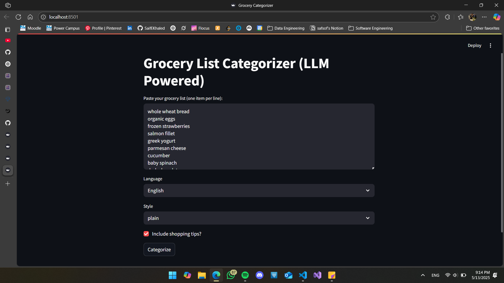
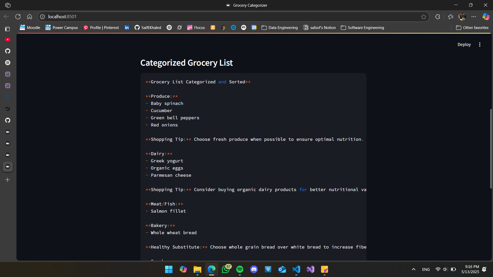

# 🛒 Grocery List Categorizer with LLMs

A smart app that categorizes messy grocery lists into clean, structured groups using Large Language Models (LLMs) — like fruits, vegetables, dairy, etc.

Built with:
- 🧠 Ollama (LLaMA 3.2)
- 🌐 Streamlit for interactive UI
- 🐍 Python

---

## 🚀 Features

✅ Categorizes grocery items by type (Fruits, Vegetables, Dairy, etc.)  
✅ Accepts messy, free-form input  
✅ Uses LLM-powered prompt engineering  
✅ Clean and simple Streamlit UI

---

## 📸 Demo

### 🖥 Local Run (With Real LLM Output)



> Categorizes for example: "1kg banana, 2 packs of milk, 5kg rice" into:
>
> - Fruits: banana  
> - Dairy: milk  
> - Grains: rice

---


> ⚠️ Note: **Ollama is not supported on Streamlit Cloud**.

---

## 💻 Run Locally (With Ollama)

### 1. Install Requirements
```bash
pip install -r requirements.txt
